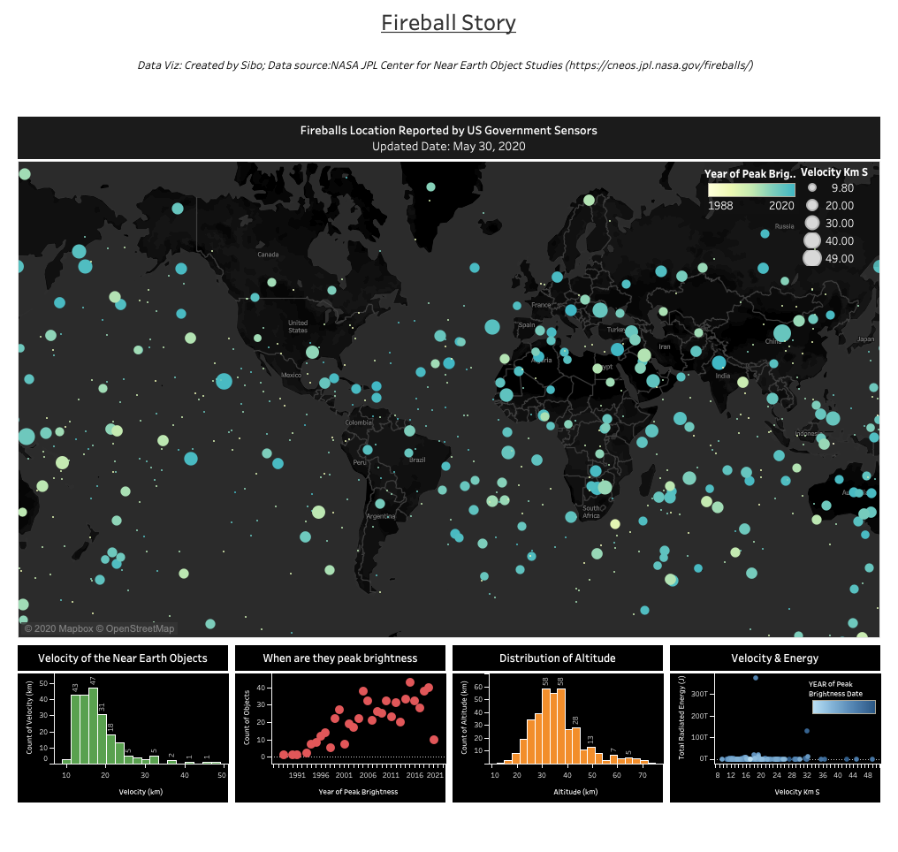

# Fireballs Reported by NASA.

### Data description:

- According to NASA, the Geostationary Lightning Mapper (GLM) instruments on GOES weather satellites was able to detect fireballs and bolides. The data was about the date and time of each reported fireball event.

### Data source: [NASA JPL Center for Near Earth Object Studies](https://cneos.jpl.nasa.gov/fireballs/)

### Data visualization overview:

- The map will tell viewers how those fireball events located all over the world. Meanwhile, there are year of peak brightness and velocity	information for each event included in the map.
- By looking at the garphs/charts at the bottom of the dashboards, four sets of relationships among fireballs' attributes could be demonstrated.

### About this data viz:

- A Tableau Dashboard using public datasets below. You can find each Tableau Workbook that I used within the "Workbook" directory in this dirctory. Feel free to check out charts/map of the dashboards below, and download any workbook that interests you. 

#### Dashboard:

