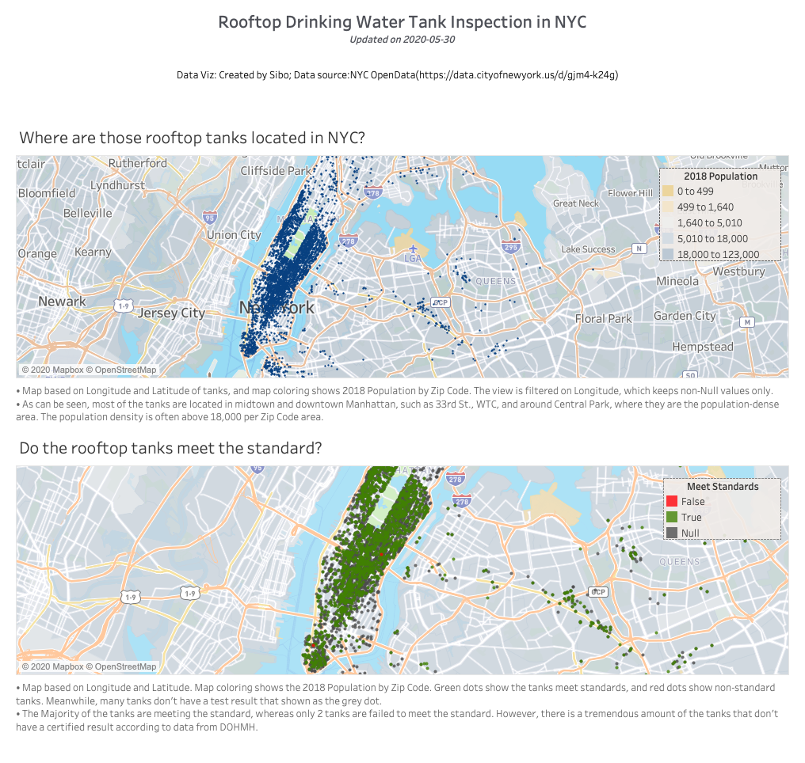
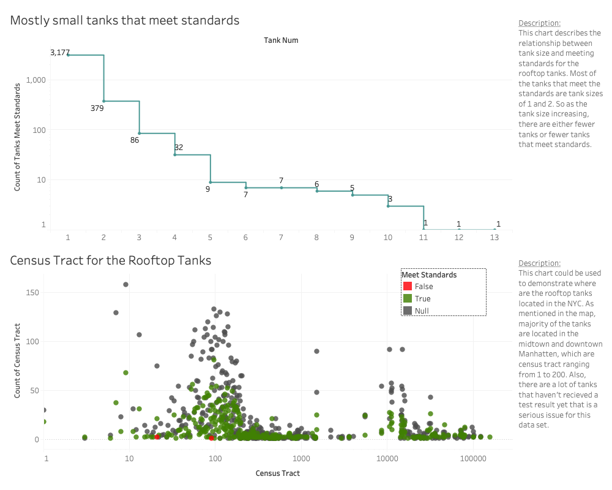
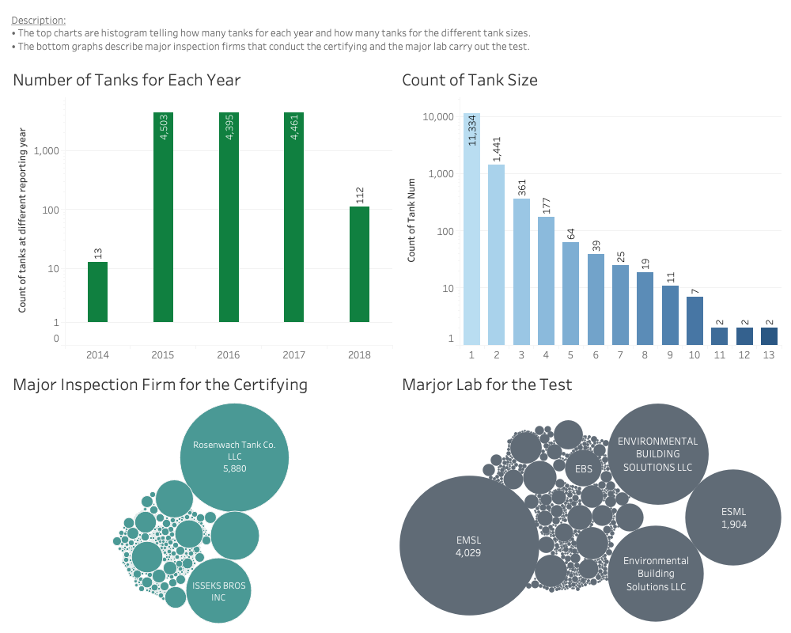
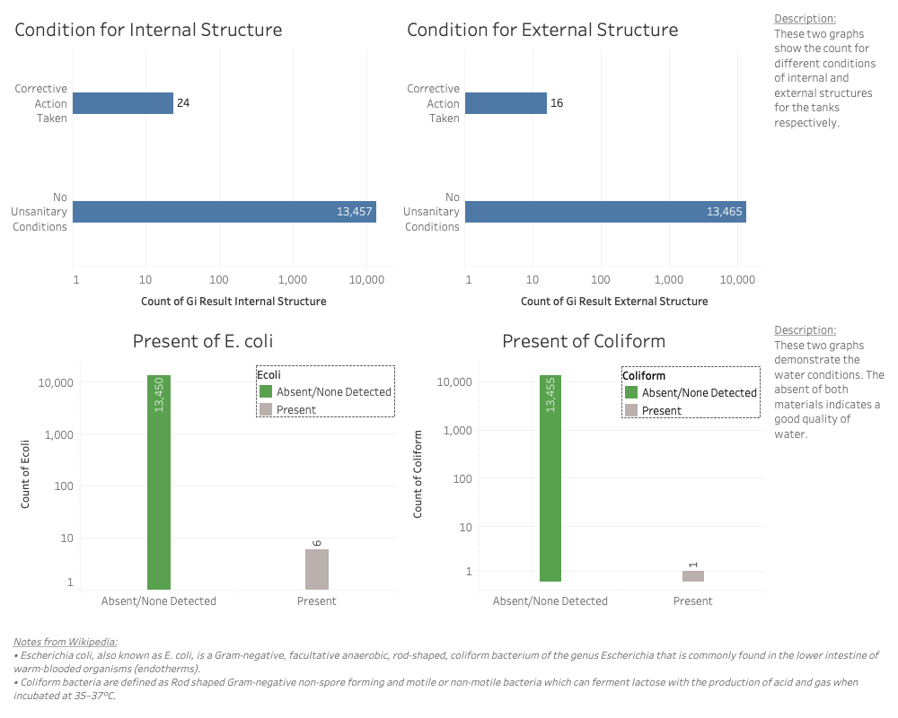

# Rooftop Drinking Water Tank Inspection Results by NYC Health Department

#### Data description:

NYC Health Code requires that building drinking water storage tanks be inspected annually and that the results of these inspections be reported to the Health Department (NYC DOHMH). To report specific inspection findings related to public safety and sanitary conditions, owners or their representatives fill out a questionnaire provided by DOHMH. This dataset is the non-administrative subset of owner-reported information. Reported data have not been verified by a City Agency.

#### Data source: 
[NYC OpenData](https://data.cityofnewyork.us/d/gjm4-k24g) (this data is updated periodically)

#### Data workflow:
The data is open source data which was collected by the NYC Health Department and distributed by data.world. This project is using Tableau as the data visualization tool calling data from data.world API. You can find the dataflow for this project below.

	

#### Data insights:
- The majority of drinking water tanks are located in population-dense areas where they also have a large amount of foodservice provided to the neighborhood. Some typical places such as 33rd St., WTC, and communities around Central Park.
- The quality of the drinking water is in good condition according to the inspection results, in which only 2 tanks are not meeting the standards. Less than 0.04% of tanks show the presence of E. coli, which can cause serious food poisoning in their hosts. However, there are a large number of tanks(roughly 10,000 inspections) don't receive an inspection result, which the reason for this situation is unknown. This could be a data issue from the source or an unspecified methodology of the data being collected and gathered.
- There are around 4,500 tanks that should have been certified for each year from 2014 to 2018. We can see that certifying numbers match the expectation for 2015, 2016, and 2017, but not for 2014 and 2018.
- The certifying is largely conducted by several companies, e.g., Rosenwach Tank Co. LLC, ISSEKS BROS INC, and American Pipe & Tank. But there are many of the inspections performed by other individual companies, which might influence the efficiency of the gathering of the test results. 

#### Dashboards:

	

	

	

	

