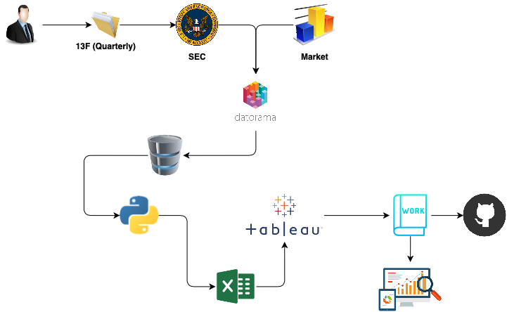
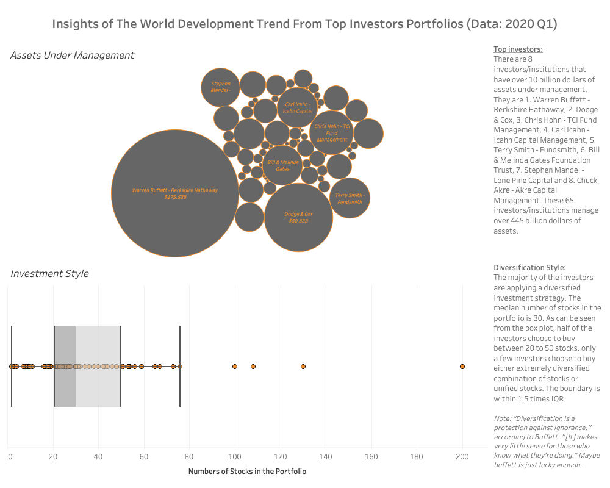
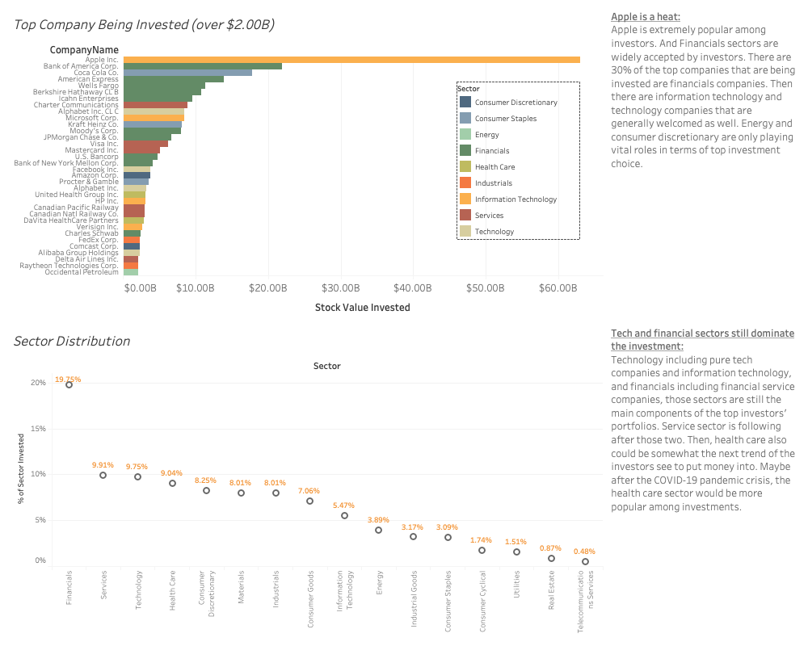
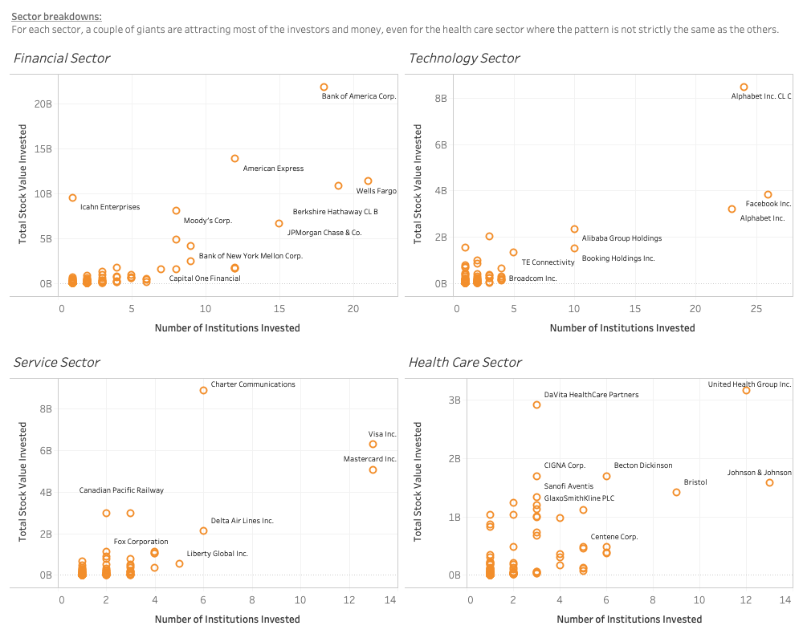

# What You Can Get From Super Investor Portfolio

#### Data description:

Top investors are always very sensitive to industry information or potentials. Plus, they can access more information and have more resources to business-related materials than normal people that make their investment more precise and profitable than general investors. Thus, just by looking at the top investors' portfolios, you will find a lot of interesting insights and valuable information. 

This project is using a Python web scraper developed by Sibo to parse data from [Dataroma](https://www.dataroma.com/m/home.php), which is containing a good portion of super investors portfolio and updating regularly. It's worth noticing that the scraper is just intended to get data more efficient for personal interests for this project, it's not for any purpose involving republishing, reproducing, redistributing, or selling of the content. The data parsed is just a limited area of data provided by Dataroma. There are also other ways to get those data, the most accurate and official channel is to get data from the Securities and Exchange Commission (SEC). According to SEC, an institutional investment manager that uses the U.S. mail (or other means or instrumentality of interstate commerce) in the course of its business, and exercises investment discretion over $100 million or more in Section 13(f) securities (explained below) must report its holdings on Form 13F with the Securities and Exchange Commission (more detail from [SEC](https://www.sec.gov/fast-answers/answers-form13fhtm.html)). 

#### Data source: 
 The data used for this project is just the 2020Q1 data from the [Dataroma](https://www.dataroma.com/m/home.php) (this data is updated periodically and you will need to update data regularly in a quarterly frequency).

***\*Important Note: This data is just for personal interests of data visualization, please do not republish, reproduce, redistribute, or sell the content, including the data. For any detail of the Dataroma content usage, please refer to the [Dataroma terms of use](https://www.dataroma.com/m/inc/tos.php)***

#### Data workflow:
The data is scraped by a Python function developed by Sibo. This project is using Tableau as the data visualization tool calling data from local .csv files that scraped quarterly. You can find the dataflow for this project below.

    

#### Data insights:
- Apple is a extremly popular company that dominates the super investors' portfolios.
- Technology including pure tech companies and information technology, and financials including financial service companies, those sectors are still the main components of the top investors' portfolios.
- For each main sector, a couple of giants are attracting most of the investors and money, even for the health care sector where the pattern is not strictly the same as the others. 
- Technology is still the future!! And probably in a foreseeable amount of decades, the tech giants are still going to lead the development of the world (this is just a personal opinion).

#### Dashboards:

    

    

    

    

